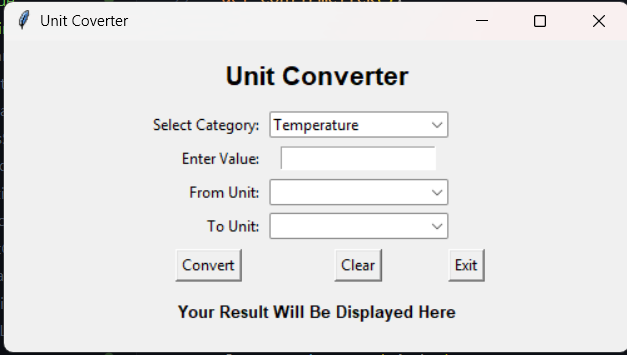

# Unit Converter GUI

This folder contains a simple graphical unit converter built with Python's `tkinter` library.

## Features
- Choose a category: `Temperature`, `Distance`, or `Weight`
- Enter a numeric value to convert
- Select the unit to convert from and the unit to convert to
- View the result in the interface
- Use the buttons to convert, clear the form, or exit the program

## Supported Conversions
- Temperature
  - Celsius (`C`) to Fahrenheit (`F`)
  - Fahrenheit (`F`) to Celsius (`C`)
- Distance
  - Kilometers (`Km`) to Miles (`mi`)
  - Miles (`mi`) to Kilometers (`Km`)
- Weight
  - Kilograms (`Kg`) to Pounds (`lbs`)
  - Pounds (`lbs`) to Kilograms (`Kg`)

## Formulas
- Celsius to Fahrenheit: `F = C × 9/5 + 32`
- Fahrenheit to Celsius: `C = (F - 32) × 5/9`
- Kilometers to Miles: `mi = km × 0.62137`
- Miles to Kilometers: `km = mi / 0.62137`
- Kilograms to Pounds: `lbs = kg × 2.20462`
- Pounds to Kilograms: `kg = lbs / 2.20462`

## Notes
- The program checks whether the entered value is numeric before doing the conversion.
- The **Clear** button resets the input and result fields.
- The **Exit** button closes the application.

## Screenshot

